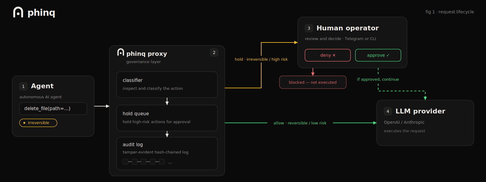

<p align="center">
  
</p>

<h1 align="center">Phinq</h1>

<p align="center">
  <b>The open-source runtime checkpoint for AI agents.</b><br/>
  Inspect every tool call. Hold the irreversible for approval. Keep verifiable evidence of human oversight.
</p>

<p align="center">
  <a href="LICENSE"></a>
  <a href="https://nodejs.org/"></a>
  <a href="https://www.typescriptlang.org/"></a>
  <a href="https://github.com/phinq-co/phinq"></a>
  <a href="https://github.com/phinq-co/phinq/actions"></a>
  <a href="https://phinq.co"></a>
</p>

---

Phinq sits between your agent and the world, **classifies every action** it tries to take, **holds the dangerous ones** for your approval, and writes a **tamper-evident audit log** of everything. Two ways to run it:

- **Proxy** — drop it in front of any agent that speaks the OpenAI or Anthropic APIs (just set `base_url`). No agent-code change.
- **SDK** (`@phinq/governance`) — import it into a TypeScript agent and gate tool execution **in-process**, before it runs.

Both share one deterministic decision engine, one audit format, and one set of risk rules.

## Demo

```
Agent: delete_file(path="/tmp/test.log")
       │
       ▼
  ┌───────────────┐
  │  Phinq Proxy  │
  │               │
  │  Classifier → │   IRREVERSIBLE_MEDIUM → HOLD 🛑
  │  Hold Queue → │   Telegram: "delete_file — [Approve] [Deny]"
  │  Audit Log →  │   Hash-chained JSONL ✓
  └───────────────┘
       │
       ▼
Operator taps "Approve" → response released byte-identical
Operator taps "Deny" → agent gets synthetic denial, continues safely
Timeout (240s) → auto-deny
```

## What it does

- **Classifies every action by risk** — reversible actions pass; irreversible ones (deletes, credential access, payments, bulk operations, comms volume) are held.
- **Holds high-risk actions for a human** — approve or deny from your phone, the CLI, or a programmatic handler; auto-denies on timeout.
- **Tamper-evident audit log** — hash-chained (RFC 8785 JCS, SHA-256). Editing, reordering, or deleting any entry is detectable.
- **Velocity awareness** — catches "the swarm sent 50 emails" or "300 calls in two minutes" via rolling-window triggers.
- **Token regulation** — reads every response's `usage` block; a session that burns past your token budget gets checkpointed until a human waves it on, and all spend lands in the audit report.
- **Precedent** — `phinq learn` compiles your approve/deny history into cited policy proposals; applied changes are themselves chain-recorded. The checkpoint learns your judgment — deterministically.

## Quick start — two minutes, no config

```bash
npx @phinq/phinq
```

The wizard detects what you run (Claude Code, Codex, Hermes, MCP…), asks three plain-English questions, and prints the one line to paste. It starts in **watch-only mode** — nothing is blocked until you say so. Then `phinq start` runs the checkpoint and `phinq watch` shows anything held.

## Quick start — proxy (from source)

```bash
git clone https://github.com/phinq-co/phinq.git
cd phinq/proxy
npm install && npm run build && npm start
# listens on 127.0.0.1:5100
```

Then point your agent at it:

```yaml
# Hermes config (~/.hermes/config.yaml)
model:
  base_url: http://127.0.0.1:5100/api/v1   # was https://openrouter.ai/api/v1
```

Your existing API key flows through the `Authorization` header — the proxy never stores or logs it.

### Enable enforcement (Telegram holds)

```bash
PHINQ_ENFORCE=1 \
PHINQ_TELEGRAM_BOT_TOKEN=*** \
PHINQ_TELEGRAM_CHAT_ID=*** \
npm start
```

Create a bot with [@BotFather](https://t.me/BotFather), send it one message, get your chat ID (e.g. via @userinfobot). That's it. On a HOLD you'll receive Approve/Deny buttons.

### Or approve from Slack

```bash
PHINQ_ENFORCE=1 \
PHINQ_SLACK_BOT_TOKEN=xoxb-*** \
PHINQ_SLACK_APP_TOKEN=xapp-*** \
PHINQ_SLACK_CHANNEL=C0123456789 \
npm start
```

Create an app at [api.slack.com/apps](https://api.slack.com/apps): enable **Socket Mode** (generates the `xapp-` token with `connections:write`), add the bot scopes `chat:write` + `chat:write.public`, enable **Interactivity**, install to your workspace, and invite the bot to your approvals channel. Holds appear as messages with Approve/Deny buttons; the first decision (from Slack, Telegram, or the CLI) wins. Optionally restrict who can decide with `PHINQ_SLACK_OPERATOR_IDS=U111,U222`.

## Quick start — MCP gateway

Wrap **any stdio MCP server** with the checkpoint — no agent or server changes. Install once, globally:

```bash
npm install -g @phinq/phinq
```

Then reference `phinq-mcp` directly in your MCP client config (avoid nesting it inside another `npx` call — some `npx`-inside-`npx` setups fail to resolve the wrapped command):

```jsonc
// your MCP client config (Claude Code, Codex, any MCP client)
{
  "mcpServers": {
    "filesystem": {
      "command": "phinq-mcp",
      "args": ["--enforce", "--",
               "npx", "-y", "@modelcontextprotocol/server-filesystem", "/data"]
    }
  }
}
```

The gateway intercepts every `tools/call` at the execution boundary: safe calls pass through untouched, held calls wait for your approval (CLI `phinq approve <id>`, Telegram, or Slack — same channels as the proxy), and denials return a clean tool error the agent can recover from. Every decision joins the same hash-chained audit log. Without `--enforce` it runs in shadow mode. From a checkout: `npm run mcp -- --enforce -- <server command>`.

## Quick start — SDK

```ts
import { PhinqGovernor } from "@phinq/governance";

const governor = new PhinqGovernor();
const { allowed } = await governor.gate(
  { name: "run_shell", args: { command } },
  { onHold: (req) => askOperator(req) }  // returns "approve" | "deny"
);

if (allowed) await runTool();
```

## Configuration

| Env var | Default | What it does |
|---|---|---|
| `PHINQ_PORT` | `5100` | Listen port |
| `PHINQ_HOST` | `127.0.0.1` | Bind address |
| `PHINQ_UPSTREAM` | `https://openrouter.ai` | Upstream origin |
| `PHINQ_ANTHROPIC_UPSTREAM` | `https://api.anthropic.com` | Anthropic upstream |
| `PHINQ_TOOLCALL_LOG` | `phinq-toolcalls.jsonl` | Tool call corpus; `""` disables |
| `PHINQ_AUDIT_LOG` | `phinq-audit.jsonl` | Hash-chained audit log |
| `PHINQ_ENFORCE` | unset | `1`/`true` turns on holds |
| `PHINQ_HOLD_TIMEOUT_S` | `240` | Approval window |
| `PHINQ_TELEGRAM_BOT_TOKEN` | unset | Bot token (env only) |
| `PHINQ_TELEGRAM_CHAT_ID` | unset | Operator chat ID |
| `PHINQ_SLACK_BOT_TOKEN` | unset | Slack bot token, `xoxb-…` (env only) |
| `PHINQ_SLACK_APP_TOKEN` | unset | Slack app token for Socket Mode, `xapp-…` |
| `PHINQ_SLACK_CHANNEL` | unset | Channel ID for hold messages |
| `PHINQ_SLACK_OPERATOR_IDS` | unset | Comma-separated user IDs allowed to decide |
| `PHINQ_LOG_LEVEL` | `info` | Pino log level |

## Classifier (risk levels)

Every tool call is classified into one of five levels:

| Level | Behaviour | Examples |
|---|---|---|
| `RISK_REDUCING` | Always pass | Cancelling a task, reverting a change |
| `REVERSIBLE` | Always pass | Reading a file, writing a draft |
| `IRREVERSIBLE_LOW` | Pass | Single email, single file write |
| `IRREVERSIBLE_MEDIUM` | **HOLD** | Deletions, comms volume, config changes |
| `IRREVERSIBLE_HIGH` | **HOLD + escalate** | Credential access, billing, disable safeguards |

### Structural triggers (always escalate to HOLD)

- `BULK_DELETE` — >5 items in a session
- `CREDENTIAL_ACCESS` — reading `.env`, secrets, API keys
- `EXTERNAL_COMM_VOLUME` — >3 outbound sends per session
- `PERMISSION_ESCALATION` — sudo, chmod, IAM changes
- `BILLING_MODIFICATION` — payment, subscription changes
- `AFTER_ERROR_BULK` — bulk ops within 10 min of an error
- `DISABLE_SAFEGUARDS` — modifying the governance layer itself
- `TOKEN_BUDGET` — session token burn exceeds your budget (opt-in)

Tune thresholds via `phinq.yaml`:

```yaml
thresholds:
  external_comm_volume: 3
  bulk_delete_count: 5
  session_token_budget: 500000  # tokens per session window; 0/absent = off
session:
  window_minutes: 60
tools:
  send_newsletter: REVERSIBLE   # override a tool's default class
```

### Token regulation — the fuel gauge

The proxy reads the `usage` block of every response (all three dialects) and keeps a rolling per-session token count. Set `session_token_budget` and a session that burns past it gets **checkpointed**: every subsequent tool call holds for approval until you wave it on — a runaway loop can't quietly spend all night. Usage is also written to the audit chain and totalled (per model) in `phinq report`. Off by default, so routine sessions never false-HOLD.

## Audit log (tamper-evident)

Every decision is appended to a hash-chained JSONL file. The first line is a genesis entry with a random `log_id`. Each subsequent entry carries `prev_hash` and `entry_hash = sha256(prev_hash + jcs(entry))`. Modify one byte and verification fails:

```bash
npm run audit:verify -- phinq-audit.jsonl
# OK — 1402 entries, chain intact
```

### Replay — calibrate before enforcing

```bash
npm run replay -- phinq-toolcalls.jsonl [phinq.yaml]
```

Reclassify a captured corpus. Tune thresholds, re-run. Only turn enforcement on once you have zero false HOLDs on routine operations.

### Oversight report — turn the log into evidence

```bash
npm run report -- phinq-audit.jsonl --md oversight-report.md --json oversight-report.json
```

Generates a verifiable **human-oversight report** from the audit chain: every decision, hold outcome, operator approval, and graded assessment — including the **false-hold rate** (your calibration metric) and estimated damage prevented. The report pins the log's final entry hash and carries its own SHA-256 over the JCS-canonical body, so report and log validate each other.

Useful as standing evidence of human oversight over an autonomous system — e.g. for an **EU AI Act Article 14** oversight file, an internal audit, or a customer security review.

### Precedent — the checkpoint that learns your judgment

```bash
phinq learn                 # propose policy from your approve/deny history
phinq learn --apply         # write it to phinq.yaml + record it in the chain
```

Every hold ends in a human verdict; `phinq assess` grades whether the intervention was right. **Precedent compiles that judgment into policy — case law for agents, not a learned black box.** A tool you've approved 5+ times unanimously (with zero incidents and no structural triggers) is proposed for relaxation, *citing its evidence*; a tool you keep denying — or whose hold was graded a true positive — is proposed for pinning at always-hold:

```
send_newsletter  → relax to IRREVERSIBLE_LOW
  precedent: approved 6/6 decided holds by 1 operator(s), zero denials, zero incidents
drop_table       → pin at IRREVERSIBLE_HIGH
  precedent: denied 2/2 decided holds
```

Applying writes phinq.yaml **and appends a `policy_change` entry to the audit chain** — policy evolution itself is tamper-evident, so an auditor can replay why any decision was made against the policy in force at the time. Structural-trigger holds (credentials, billing, escalation…) are never relaxable, and no change applies without your command. The checkpoint gets quieter and sharper the longer it runs: **observe (shadow) → calibrate (replay) → learn (precedent).**

## Works with

OpenRouter, OpenAI (Codex, Agents SDK), Anthropic, Mastra, LangChain/LangGraph, Vercel AI SDK, CrewAI, AutoGen, Pydantic AI, LlamaIndex, Hugging Face, and any runtime that speaks the OpenAI or Anthropic APIs with a configurable base URL.

Already running **LiteLLM**? Chain the proxies or drop in the Phinq guardrail — see [docs/litellm.md](docs/litellm.md). Python-side gating is `pip install phinq` ([python/](python/)).

*(Compatibility, not affiliation — trademarks belong to their owners.)*

## Related

- **Advisory skill** (lighter, no infra): [github.com/phinq-co/phinq-governance](https://github.com/phinq-co/phinq-governance)
- **Hosted** (dashboards, anomaly detection, team approvals, compliance-grade audit): [phinq.co](https://www.phinq.co)

## License

MIT