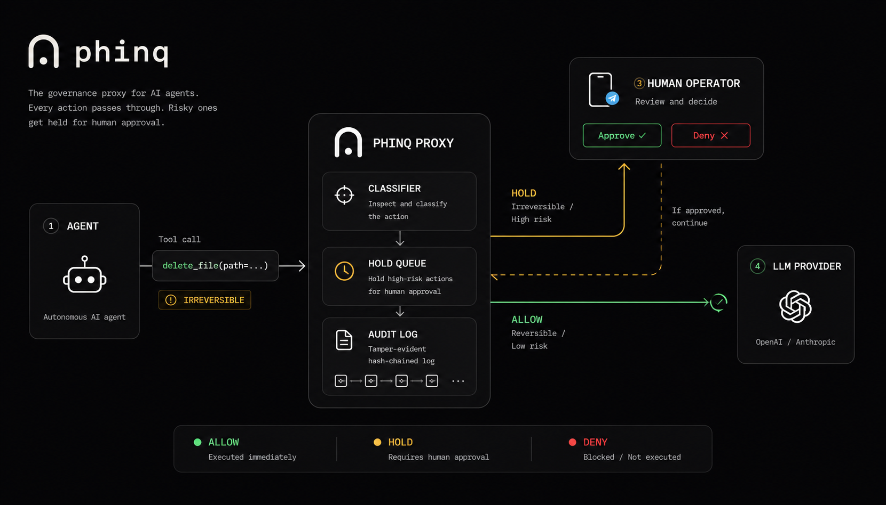

<p align="center">
  
</p>

<h1 align="center">Phinq</h1>

<p align="center">
  <b>The open-source governance layer for autonomous AI agents.</b><br/>
  Know what your agent did. Stop it before it doesn't.
</p>

<p align="center">
  <a href="LICENSE"></a>
  <a href="https://nodejs.org/"></a>
  <a href="https://www.typescriptlang.org/"></a>
  <a href="https://github.com/phinq-co/phinq"></a>
  <a href="https://github.com/phinq-co/phinq/actions"></a>
  <a href="https://phinq.co"></a>
</p>

---

Phinq sits between your agent and the world, **classifies every action** it tries to take, **holds the dangerous ones** for your approval, and writes a **tamper-evident audit log** of everything. Two ways to run it:

- **Proxy** — drop it in front of any agent that speaks the OpenAI or Anthropic APIs (just set `base_url`). No agent-code change.
- **SDK** (`@phinq/governance`) — import it into a TypeScript agent and gate tool execution **in-process**, before it runs.

Both share one deterministic decision engine, one audit format, and one set of risk rules.

## Demo

```
Agent: delete_file(path="/tmp/test.log")
       │
       ▼
  ┌───────────────┐
  │  Phinq Proxy  │
  │               │
  │  Classifier → │   IRREVERSIBLE_MEDIUM → HOLD 🛑
  │  Hold Queue → │   Telegram: "delete_file — [Approve] [Deny]"
  │  Audit Log →  │   Hash-chained JSONL ✓
  └───────────────┘
       │
       ▼
Operator taps "Approve" → response released byte-identical
Operator taps "Deny" → agent gets synthetic denial, continues safely
Timeout (240s) → auto-deny
```

## What it does

- **Classifies every action by risk** — reversible actions pass; irreversible ones (deletes, credential access, payments, bulk operations, comms volume) are held.
- **Holds high-risk actions for a human** — approve or deny from your phone, the CLI, or a programmatic handler; auto-denies on timeout.
- **Tamper-evident audit log** — hash-chained (RFC 8785 JCS, SHA-256). Editing, reordering, or deleting any entry is detectable.
- **Velocity awareness** — catches "the swarm sent 50 emails" or "300 calls in two minutes" via rolling-window triggers.

## Quick start — proxy

```bash
git clone https://github.com/phinq-co/phinq.git
cd phinq/proxy
npm install && npm run build && npm start
# listens on 127.0.0.1:5100
```

Then point your agent at it:

```yaml
# Hermes config (~/.hermes/config.yaml)
model:
  base_url: http://127.0.0.1:5100/api/v1   # was https://openrouter.ai/api/v1
```

Your existing API key flows through the `Authorization` header — the proxy never stores or logs it.

### Enable enforcement (Telegram holds)

```bash
PHINQ_ENFORCE=1 \
PHINQ_TELEGRAM_BOT_TOKEN=*** \
PHINQ_TELEGRAM_CHAT_ID=*** \
npm start
```

Create a bot with [@BotFather](https://t.me/BotFather), send it one message, get your chat ID (e.g. via @userinfobot). That's it. On a HOLD you'll receive Approve/Deny buttons.

## Quick start — SDK

```ts
import { PhinqGovernor } from "@phinq/governance";

const governor = new PhinqGovernor();
const { allowed } = await governor.gate(
  { name: "run_shell", args: { command } },
  { onHold: (req) => askOperator(req) }  // returns "approve" | "deny"
);

if (allowed) await runTool();
```

## Configuration

| Env var | Default | What it does |
|---|---|---|
| `PHINQ_PORT` | `5100` | Listen port |
| `PHINQ_HOST` | `127.0.0.1` | Bind address |
| `PHINQ_UPSTREAM` | `https://openrouter.ai` | Upstream origin |
| `PHINQ_ANTHROPIC_UPSTREAM` | `https://api.anthropic.com` | Anthropic upstream |
| `PHINQ_TOOLCALL_LOG` | `phinq-toolcalls.jsonl` | Tool call corpus; `""` disables |
| `PHINQ_AUDIT_LOG` | `phinq-audit.jsonl` | Hash-chained audit log |
| `PHINQ_ENFORCE` | unset | `1`/`true` turns on holds |
| `PHINQ_HOLD_TIMEOUT_S` | `240` | Approval window |
| `PHINQ_TELEGRAM_BOT_TOKEN` | unset | Bot token (env only) |
| `PHINQ_TELEGRAM_CHAT_ID` | unset | Operator chat ID |
| `PHINQ_LOG_LEVEL` | `info` | Pino log level |

## Classifier (risk levels)

Every tool call is classified into one of five levels:

| Level | Behaviour | Examples |
|---|---|---|
| `RISK_REDUCING` | Always pass | Cancelling a task, reverting a change |
| `REVERSIBLE` | Always pass | Reading a file, writing a draft |
| `IRREVERSIBLE_LOW` | Pass | Single email, single file write |
| `IRREVERSIBLE_MEDIUM` | **HOLD** | Deletions, comms volume, config changes |
| `IRREVERSIBLE_HIGH` | **HOLD + escalate** | Credential access, billing, disable safeguards |

### Structural triggers (always escalate to HOLD)

- `BULK_DELETE` — >5 items in a session
- `CREDENTIAL_ACCESS` — reading `.env`, secrets, API keys
- `EXTERNAL_COMM_VOLUME` — >3 outbound sends per session
- `PERMISSION_ESCALATION` — sudo, chmod, IAM changes
- `BILLING_MODIFICATION` — payment, subscription changes
- `AFTER_ERROR_BULK` — bulk ops within 10 min of an error
- `DISABLE_SAFEGUARDS` — modifying the governance layer itself

Tune thresholds via `phinq.yaml`:

```yaml
thresholds:
  external_comm_volume: 3
  bulk_delete_count: 5
session:
  window_minutes: 60
tools:
  send_newsletter: REVERSIBLE   # override a tool's default class
```

## Audit log (tamper-evident)

Every decision is appended to a hash-chained JSONL file. The first line is a genesis entry with a random `log_id`. Each subsequent entry carries `prev_hash` and `entry_hash = sha256(prev_hash + jcs(entry))`. Modify one byte and verification fails:

```bash
npm run audit:verify -- phinq-audit.jsonl
# OK — 1402 entries, chain intact
```

### Replay — calibrate before enforcing

```bash
npm run replay -- phinq-toolcalls.jsonl [phinq.yaml]
```

Reclassify a captured corpus. Tune thresholds, re-run. Only turn enforcement on once you have zero false HOLDs on routine operations.

## Works with

OpenRouter, OpenAI (Codex, Agents SDK), Anthropic, Mastra, LangChain/LangGraph, Vercel AI SDK, CrewAI, AutoGen, Pydantic AI, LlamaIndex, Hugging Face, and any runtime that speaks the OpenAI or Anthropic APIs with a configurable base URL.

*(Compatibility, not affiliation — trademarks belong to their owners.)*

## Related

- **Advisory skill** (lighter, no infra): [github.com/phinq-co/phinq-governance](https://github.com/phinq-co/phinq-governance)
- **Hosted** (dashboards, anomaly detection, team approvals, compliance-grade audit): [phinq.co](https://www.phinq.co)

## License

MIT